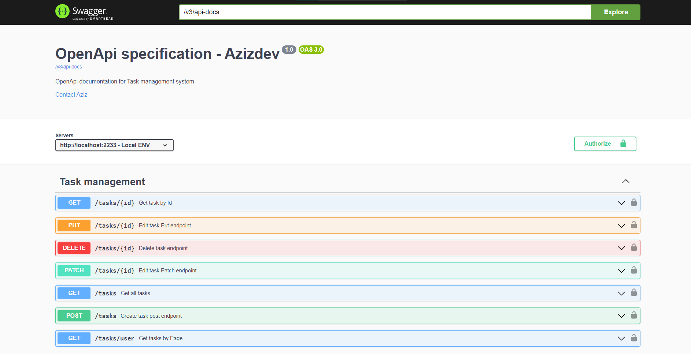
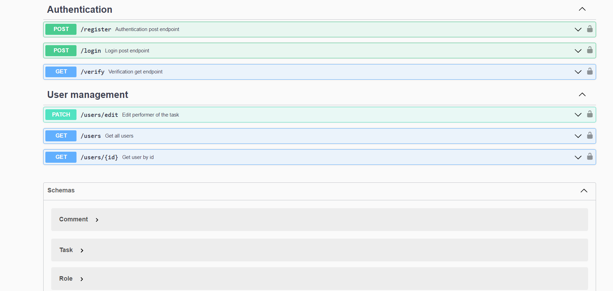

# Task Management System
This is a simple task management system build on java. System has creation, editing, deleting and viewing tasks endpoints. Each task has the title, description, status, priority and the author of the task. This project is only the API.

## Features
* User registration and login with JWT authentication
* Password encryption using BCrypt
* Role-based authorization with Spring Security
* Customized access denied handling

## Technologies
* Spring Boot 3.0
* Spring Security
* Spring Validation
* Project Lombok
* Mapstruct
* JSON Web Tokens (JWT)
* Postgresql
* Spring doc (Swagger UI & Open API)
* Docker

## Getting Started
To get started with this project, you will need to have the following installed on your local machine:

* JDK 17+
* Maven 3+
* Docker

To build and run the project, follow these steps:

* Clone the repository: `git clone https://github.com/AzizDeveloper/task-management-system`
* Create or use one of your gmail account to use Email registering. Add these credentials and database configurations to application-dev.yml
* Build the project: mvn clean install
* Run the project: mvn spring-boot:run

-> The application will be available at http://localhost:2233.

Screenshots of swagger-ui:

